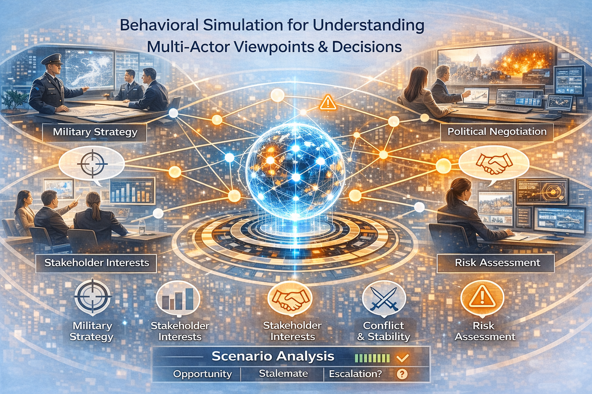

# ActorScope-AI

<p align="center">
  
</p>

<p align="center">
  
  
  
  
  
  
  
  
</p>

**ActorScope-AI** is a **Dynamic Agentic AI** simulation engine that helps you model how multiple autonomous stakeholders interpret a shared situation, react to one another, and shape the trajectory of a scenario over time. Instead of collapsing a complex environment into a single answer, it models actors, relationships, world state, and decisions explicitly so the evolution of the scenario can be inspected round by round.

---

## What it does

ActorScope-AI is a **Dynamic Agentic AI** simulation engine for analyzing how multiple actors behave inside a shared environment.

### Dynamic
The system models **dynamic state evolution** where:
- Actor interpretations change round by round
- Relationships evolve based on interactions
- Environment state mutates based on actions
- Scenarios progress through multiple possible trajectories

### Agentic  
Each actor operates as an **autonomous agent** with:
- Individual goals, priorities, and constraints
- Personal interpretation of the shared situation
- Independent reasoning and decision-making
- Capability to influence other actors and the environment

### AI
The system leverages **AI-powered reasoning** for:
- LLM-backed actor interpretation
- Intelligent action selection
- Impact estimation and evaluation
- Pattern recognition across scenarios

It is designed for situations where outcomes emerge from:

- competing incentives
- partial alignment and partial conflict
- asymmetric power and dependency
- changing interpretations over time
- reactions to previous actions
- evolving relationships between actors

Instead of treating a scenario as a single-agent problem, ActorScope-AI models it as a structured, stateful multi-actor system with:

- explicit actors
- directional relationships
- shared environment and scenario state
- round-by-round reasoning
- structured action selection
- durable memory across runs
- traceable outcomes and artifacts

Typical questions the system can support:

- What is each actor optimizing for?
- Who is most likely to act next?
- What action is most likely to be taken?
- Where are the key tensions?
- Which relationships are deteriorating or strengthening?
- Is the scenario moving toward deadlock, escalation, or stabilization?
- What interventions could change the trajectory?

---

## Why this project exists

Many real-world situations are not well represented by a single chatbot answer or a static summary.

Organizations, negotiations, alliances, political systems, and geopolitical settings often involve multiple actors with different goals, constraints, perceptions, and red lines. ActorScope-AI exists to model those dynamics explicitly, while still keeping execution controlled, inspectable, and extensible.

---

## Example scenario

A labor negotiation between company leadership, union representatives, department managers, and government observers.

ActorScope-AI can model:

- each actor’s goals, constraints, and priorities
- directional relationships such as trust, dependency, and conflict
- how one round of actions changes the state of the environment
- how the next likely actor is selected
- whether the system is moving toward compromise, deadlock, or escalation

This makes the project useful not only for generating a plausible next action, but for understanding why that action emerged and how the broader scenario is shifting.

---

## Why it is different

### Explicit multi-actor state

Actors are modeled directly rather than compressed into one blended narrative.

### Relationship-aware reasoning

Relationships are directional and can encode trust, alignment, conflict, dependency, influence, and perceived reliability.

### Hybrid reasoning and control

LLMs are used where perspective and action choice matter, while world mutation and evaluation stay bounded and deterministic.

### Inspectable execution

Runs can produce artifacts such as traces, final outputs, and summaries, so decisions can be reviewed round by round.

### Durable memory

The system is designed to store and retrieve actor memory, relationship memory, and scenario-pattern memory across runs.

### Typed state and contracts

State structures and prompt contracts are typed, making the system easier to reason about, extend, and test.

---

## Quick Start

### Prerequisites

- Python 3.11+
- Poetry
- Ollama running locally

### 1. Clone the repository

```bash
git clone git@github.com:iosifidisvasileios/ActorScope-AI.git
cd ActorScope-AI
```

### 2. Install dependencies

```bash
poetry install
```

### 3. Make sure Ollama is running

```bash
ollama list
```

Recommended models from the current setup:

```bash
ollama pull llama3.1:8b
ollama pull nomic-embed-text
```

### 4. Create `.env`

```env
OLLAMA_BASE_URL=http://localhost:11434
OLLAMA_CHAT_MODEL=llama3.1:8b
OLLAMA_TEMPERATURE=0.2

USE_LLM_INTERPRETATION=true
USE_LLM_ACTION_SELECTION=true

MEM0_ENABLED=false
MEM0_USE_OLLAMA=true
MEM0_LLM_MODEL=llama3.1:8b
MEM0_EMBEDDER_MODEL=nomic-embed-text
MEM0_TOP_K=5
MEM0_SEARCH_THRESHOLD=0.3
```

### 5. Run the demo

```bash
poetry run python main.py
```

### 6. Inspect artifacts

After the run, inspect:

- `artifacts/trace.jsonl`
- `artifacts/final_output.json`
- `artifacts/summary.md`

These artifacts make it possible to inspect not only the final outcome, but how the system got there.

---

## Architecture snapshot

### Stack

- LangGraph for orchestration
- Ollama for LLM-backed reasoning
- Mem0 for durable memory
- Pydantic for typed state and contracts

### Current execution model

- world-first initialization
- hybrid round/turn loop
- all actors interpret the scenario each round
- one primary actor acts each round
- deterministic mutation of world state
- per-round evaluation and stop checks
- run artifacts for inspection

### Current LLM usage

At the current stage:

- actor interpretation is LLM-backed
- action selection is LLM-backed
- state mutation remains deterministic
- evaluation remains deterministic

That split is intentional. It keeps reasoning flexible while preserving control over world updates.

---

## Core idea

The system separates simulation into three layers.

### Canonical state

Longer-lived run state:

- actors
- relationships
- environment
- scenario
- event history
- evaluation

### Round-local reasoning

Temporary per-round state:

- actor interpretations
- salience scores
- selected actors
- action proposals
- impact estimates

### Run control

Execution state:

- run id
- current round
- stop conditions
- deadlock counters
- escalation counters

This separation keeps the system inspectable and extensible.

---

## Key features

### Multi-actor simulation

Actors can carry:

- roles
- base objectives
- priorities
- constraints
- capabilities
- red lines
- interaction styles

### Relationship-aware reasoning

Relationships are directional and can encode:

- trust
- alignment
- conflict
- dependency
- influence
- perceived reliability

### Durable memory

The system is designed to store and retrieve:

- actor memory
- relationship memory
- scenario-pattern memory

### Decision observability

Each run can produce:

- `trace.jsonl`
- `final_output.json`
- `summary.md`

So you can inspect not only the result, but the decision path that produced it.

---

## Repository structure

```text
.
├── adrs/
├── config/
├── domains/
├── evaluation/
├── graph/
├── llm/
├── memory/
├── nodes/
├── observability/
├── prompts/
├── state_structures/
├── tests/
├── main.py
└── pyproject.toml
```

### Notable packages

- `state_structures/` — domain models and runtime graph state
- `graph/` — LangGraph assembly and routing
- `nodes/` — simulation nodes
- `prompts/` — typed prompt contracts and prompt builders
- `llm/` — Ollama wrappers and structured generation
- `memory/` — Mem0 retrieval, distillation, persistence
- `observability/` — trace models and artifact generation

---

## Current status

ActorScope-AI is currently in an architecture-first implementation phase.

### Already in place

- typed state model
- LangGraph execution loop
- LLM-backed interpretation and action selection
- deterministic update and stop logic
- decision trace and round summaries
- decision-level ADRs

### Still evolving

- richer memory usage during reasoning
- broader scenario coverage
- stronger test coverage
- future UI and interaction layers
- more advanced evaluation logic

---

## Design principles

The project currently follows these decisions:

- domain-agnostic core
- state-driven execution
- single-writer ownership for mutable state
- deterministic world mutation
- incremental LLM rollout
- dual memory: runtime history vs durable memory
- observability as a first-class concern

---

## Roadmap direction

The long-term direction is to support richer multi-actor simulation while preserving:

- explicit state
- controlled execution
- inspectable decisions
- reusable memory
- extensibility for future interfaces

---

## Contributing

Contributions, discussion, and architecture feedback are welcome.

A good place to start is:

- reviewing the ADRs
- inspecting the state structures and graph flow
- proposing improvements to reasoning, evaluation, or observability
- expanding scenario coverage and tests

---

## License

This project is licensed under the MIT License. See the [LICENSE](LICENSE) file for details.